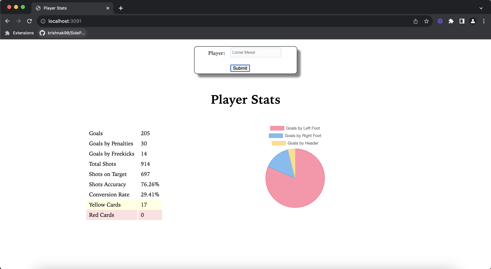

Dataset: https://www.kaggle.com/datasets/secareanualin/football-events/data

This is a football (soccer) dataset containing 9074 games, totaling 941,009 events from the biggest 5 European football.

Data Preprocessing: 
I used some python scripts to clean the data. Since my data was csv, some text fields contained a comma internally, causing issues in Java. I had to replace these commands with colons. Apart from this, there were also a few events with missing information, which I removed. 
I then split the data into 2 parts, 99% for the batch layer, and 1% for mocking the speed layer streaming. 
I then moved these to hdfs
I created 3 tables for managing data:
football_events - these have all the events from the batch layer csv data
events_player (managed by hive) - I group entries of football_events by player name. I remove any entries that don't contain player name, or player name is empty/null
events_player_hbase - this is created in HBase, and contains the same columns as events_player

For creating these tables, I ran (in order)
1. football_events.hql 
2. player_data.hql
3. create_hbase.hql
4. write_to_hbase.hql 

In app/ folder, my app.js queries the events_player_hbase HBase table, and I display the results using some basic HTML and CSS. 

Kakfa topic name - mpcs53014_football_stream

I created a kafka topic, which streams all the football events. 

My event streaming ingestion codebase is kafka, and consumer is kafka_consumer. These have been created using the archetypes given in MPCS53014, mentioned in class.

kafka_producer
1. FootballEvent - POJO. Just contains the event fields and their getters/setters
2. StreamEventsIntoKafka - Reads data from football_events_speed_data.csv (PLEASE ENSURE this csv file is present in the same folder as your uberjar). Each event from the CSV file is read and placed onto the message queue in blocks of 10. The program retrieves new blocks every 2 seconds. I chose this interval because it aligns with the expected frequency of realistic data. On average, an event occurs approximately every minute. Considering the likelihood of multiple games running simultaneously, this timeframe seemed to be a reasonable estimate.

kafka_consumer
1. FootballEvent - Plain object in Scala
2. StreamEvents - This reads data from our kafka topic, and then updates the appropriate entries in HBase. One change is that I needed to add boolean columns_to_be_updated, to check if any column needed updating. This is because there are a lot of irrelevant (to my app) events, like substitutions. 

Issues/Future Work
1. Add more fields to Hbase. 
2. Show player trends through the years. 
3. Currently, if information about the current index and blocks is inside kafka, which is not ideal. This needs to be moved to a file or Zookeeper.
4. Get real time data. I was looking at something like https://towardsdatascience.com/embedding-the-language-of-football-using-nlp-e52dc153afa6, but couldn't execute it due to time constraints.

I have placed all the necessary commands in commands file.

Screenshots: 
On hovering over the pie chart, it shows the number of goals scored by the specific bodypart as well.

Video: 
I am unable to run it on ec2, hence I've just run it locally.
Video Link: 
https://www.loom.com/share/763728e9f38d491ebbf8bbccecba1ec1?sid=fd012189-7f53-4f21-a700-45c61064333d

Note: I have stopped running the jars post the video. Kindly run the commands provided in the commands file, if you want to restart the speed layer